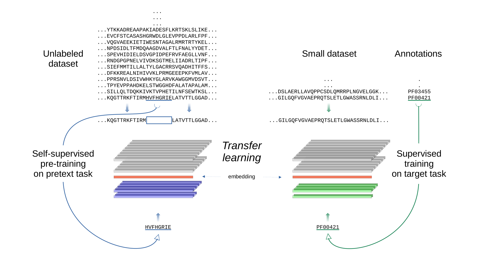

# Evaluating Large Language Models for annotating proteins

This is the source code for experiments in "Evaluating Large Language Models for annotating proteins,” by R. Vitale, L.A. Bugnon, E. Fenoy, D.H. Milone, G. Stegmayer (under review) 2023.

<p align="center">

</p>

## Installation

First, download the repository or clone it with

```
git clone https://github.com/sinc-lab/llm4pfam.git
```

We recommend using a python virtual environment such as conda or venv. For example, with conda:

```
conda create -n llm4pfam python
conda activate llm4pfam
```

### Requirements

Now on this environment, move to the repository folder and install the required packages

```
pip install -r requirements.txt
```

## Run a demo

### Download data

Since embedding sequences takes some time, precomputed embeddings are provided. You can download them from [here](https://drive.google.com/drive/folders/1Wp5zzMUES1u4neGqrR2_FAwGylNG7v7h?usp=sharing). Copy and unzip all the files you need on the root folder (`llm4pfam/`). All models require `data/` folder compressed in `data.tar.gz` file. KNN and MLP also need per-protein embeddings, while CNN needs per-residue embeddings.

Embedding files should be placed in the same folder hierarchy as in the link above. The files (with .npy or .pk extensions) are searched by default in `data/embeddings/` folder. You can change the embedding folder by passing it as a parameter with:

```
python [path/to/script.py] --embeddings [path/to/embeddings/folder/]
```

### KNN

To train and test a KNN model, run the following script:

```
python src/knn.py
```

### MLP

To train a MLP model, run the following script:

```
python src/mlp/train.py
```

Training takes approximately 1 hour per model. If you want a quick demo you can pass dev partition as train data:

```
python src/mlp/train.py --train dev
```

To test trained models, run:

```
python src/mlp/test.py
```

### CNN

We don’t provide per-residue embeddings for train partitions due to the size of the resulting file. Training lasts approximately 2 days per model. If you want a quick demo you can pass provided dev partition as train data:

```
python src/cnn/train.py --train dev
```

To test trained models, run:

```
python src/cnn/test.py
```

## Reproducing results

To reproduce KNN results, follow the same instructions in the previous section. Download embeddings and run the script:

```
python src/knn.py
```

To reproduce MLP results, you can download training embeddings provided and train 5 models:

```
python src/mlp/train.py -n 5
```

After that, run

```
python src/mlp/test.py
```

Using the test script you can see the results for each model individually, and the ensemble with all the trained models found in `models/` folder. You can change this folder by passing it as a parameter.

```
python src/mlp/test.py --models [path/to/models/]
```

To reproduce CNN results, compute the embeddings for train sequences following instructions in the next section. Then, run train script:

```
python src/cnn/train.py -n 5
```

Finally, run the test script to see the results of each model and the ensemble of models found in `models/` in `result*/` subfolders. You can change models directory with:

```
python src/cnn/test.py --models [path/to/models/]
```

## Compute embeddings

If you want to compute embeddings by yourself, run the corresponding embedding method script from `src/embeddings/`.

For example you can obtain ProtTransT5-XL-U50 per-residue embedding to test one of cnn models running following command:

```
python src/embeddings/prottranst5xlu50.py --partition test --per-residue
```

To compute ProtTrans embeddings you also need [huggingface transformers](https://huggingface.co/docs/transformers/installation) and [sentencepiece](https://pypi.org/project/sentencepiece/).

## Help

For more information about scripts parameters run:

```
python [path/to/script.py] --help
```
