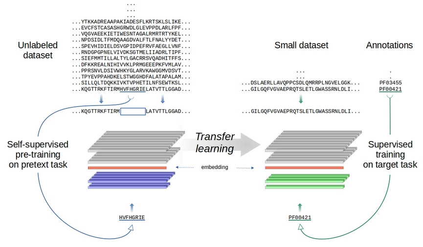

# Evaluating Large Language Models for annotating proteins

This is the source code for experiments in "Evaluating Large Language Models for annotating proteins,” by R. Vitale, L. Bugnon, E. Fenoy, D.H. Milone, G. Stegmayer, Briefings in Bioinformatics 25(3) 2024
https://academic.oup.com/bib/article/25/3/bbae177/7665115 



## Run a demo for reproducing results

If you want to run a quick demo for reproducing the results of the CNN ensemble using ProtTransT5XLU50 embedding, here is a [notebook](https://colab.research.google.com/github/sinc-lab/llm4pfam/blob/main/notebooks/LLM4Pfam_for_reproducing_results.ipynb).

## Installation

First, download the repository or clone it with

```
git clone https://github.com/sinc-lab/llm4pfam.git
```

We recommend using a python virtual environment such as conda or venv. For example, with conda:

```
conda create -n llm4pfam python=3.7
conda activate llm4pfam
```

Now on this environment, move to the repository folder and install the required packages

```
pip install -r requirements.txt
```

We provide data used in a [drive](https://drive.google.com/drive/folders/1Wp5zzMUES1u4neGqrR2_FAwGylNG7v7h?usp=drive_link) folder. You need to download the `data.tar.gz` file to repository folder and extract its content with

```
tar -xvf data.tar.gz
```

The result of this line is the `data/` folder, with Pfam data splitted on train, dev and test partitions. Those are in the `clustered/` folder (in a subfolder for partition) and it is required for all methods. The data folder also contains the file `categories.txt`, which lists all families. It is used to define the order of categories in classifiers output. This is required for MLP and CNN methods.

## Training  models

### Training KNN

To train and test a KNN model, you need per sequence embeddings for all partitions (train, dev and test). We provide them in the [drive](https://drive.google.com/drive/folders/1Wp5zzMUES1u4neGqrR2_FAwGylNG7v7h?usp=drive_link) folder. Download them for the desired embedding method.

For example, if you want to train and test a KNN using protTransT5XLU50, download all files from `llm4pfam_data/embeddings_per_sequence/protTransT5XLU50/` to the 
folder `embeddings/embeddings_per_sequence/protTransT5XLU50`. If you want another embedding method, just download the files from the corresponding folder and put it in the `embeddings/` folder.

When you have all embeddings, run this script:

```
python src/knn/traintest.py --embeddings embeddings/embeddings_per_sequence/protTransT5XLU50/
```

### Training MLP

To train a MLP model, you need the same embeddings for KNN. Follow the instructions of the previous subsection.

Then run the following script to train 5 models:

```
python src/mlp/train.py -n 5 --embeddings embeddings/embeddings_per_sequence/protTransT5XLU50/
```

Training takes approximately 1 hour per model. 

To test trained models, run:

```
python src/mlp/test.py --embeddings embeddings/embeddings_per_sequence/protTransT5XLU50/
```

### Training CNN

To train a CNN model using ProtTransT5XLU50 embedding, per residue embeddings for train and dev partitions are required. Compute them following instructions in the [Compute embeddings](#compute-embeddings) section.

Once you have all embeddings, run this script to train 5 models:

```
python src/cnn/train.py -n 5 --embeddings embeddings/embeddings_per_residue/protTransT5XLU50/
```

Keep in mind that training takes approximately 2 days per model. 

To test trained models, run:

```
python src/cnn/test.py --embeddings embeddings/embeddings_per_residue/protTransT5XLU50/
```

Using the test script you can see the results for each model individually, and the ensemble with all the trained models generated in the `models/` folder. 

## Compute embeddings

If you want to compute embeddings by yourself, run the corresponding embedding method script from `src/embeddings/`. Keep in mind that computing embeddings processing may take several hours.

For example you can obtain ProtTransT5-XL-U50 per-residue embedding to train one of cnn models running following command:

```
python src/embeddings/prottranst5xlu50.py --partition train --per-residue --embeddings data/embeddings/protTransT5XLU50/
```

For the dev partition:

```
python src/embeddings/prottranst5xlu50.py --partition dev --per-residue --embeddings data/embeddings/protTransT5XLU50/
```

For the test partition:

```
python src/embeddings/prottranst5xlu50.py --partition test --per-residue --embeddings data/embeddings/protTransT5XLU50/
```

To compute ProtTrans embeddings you also need [huggingface transformers](https://huggingface.co/docs/transformers/installation) and [sentencepiece](https://pypi.org/project/sentencepiece/).

## Help

For more information about scripts parameters run:

```
python [path/to/script.py] --help
```
